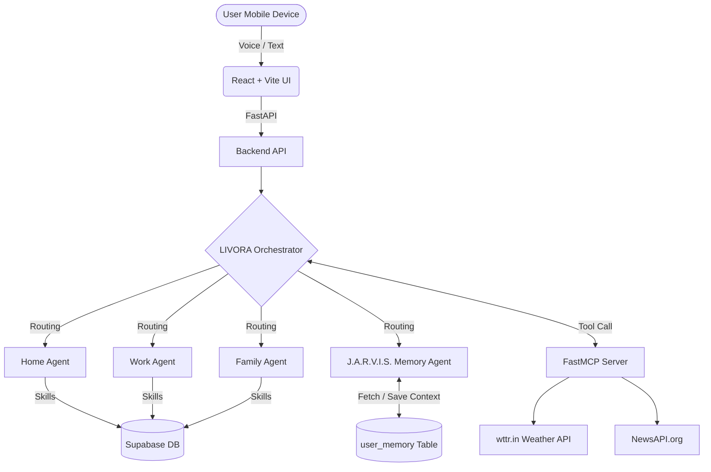

# 👑 LIVORA: I Built JARVIS for Working Mothers

> **Kaggle 5-Day AI Agents Capstone | Concierge Agents Track**
> 
> *A mobile-first AI Life Intelligence System powered by Google ADK multi-agent architecture — because every woman deserves an intelligent assistant that knows her, remembers her, and never lets her down.*

## 💜 Why I Built LIVORA

I am a fullstack developer working from home. I am also a wife and a mother.

Every single day I face the same exhausting questions:
- What should I cook tonight?
- Did I forget any appointments?
- When do I clean? When do I work?
- I am running late again...

I searched for an AI assistant that truly understood my life. Not a generic chatbot. Not another recipe app.

Something that KNOWS me. That REMEMBERS me. That manages my entire life intelligently.

I did not find it. So I built it.

This is LIVORA. She is the assistant I always needed.

---

## 🏗️ Architecture

LIVORA is built on a robust multi-agent graph architecture powered by Google's ADK and Gemini 1.5 Flash. The system is designed for progressive disclosure, meaning specialized sub-agents are only invoked when their specific domain expertise is required, keeping token usage minimal and responses lightning-fast.



## ✨ Key Features (The "Real LIVORA" Vision)

1. **The Automatic Morning Briefing**
   - Automatically detects your location via the HTML5 Geolocation API.
   - Fetches live weather for your city and personalized news headlines using the internal **FastMCP Server**.
   - Compiles your daily pending tasks from the database and delivers a beautiful, Markdown-formatted briefing as soon as you open the app.

2. **J.A.R.V.I.S. Persistent Memory**
   - LIVORA silently extracts personal facts (e.g., "I work late on Tuesdays", "I'm vegan") and saves them to a `user_memory` Supabase table.
   - The Orchestrator automatically injects your Profile into every agent's context, so LIVORA always knows exactly who she is talking to.

3. **Multi-Agent Orchestration (Google ADK)**
   - **Main Orchestrator**: Analyzes user intent and routes to specialized sub-agents.
   - **Home Agent**: Plans meals and manages shopping lists using the `meal-planner` Skill.
   - **Work Agent**: Manages deadlines and to-do lists using the `task-manager` Skill.
   - **Family Agent**: Manages calendar appointments.

4. **Voice Interface (Web Speech API)**
   - A sleek microphone UI allows you to speak directly to LIVORA. She transcribes your audio and executes commands hands-free.

## 🛠️ The Capstone Checkpoints

- [x] **Agent / Multi-agent system (ADK)**: Built a complex routing graph orchestrating 4 distinct domain agents.
- [x] **MCP Server**: Built a custom FastMCP server (`mcp_server.py`) exposing LIVORA's core context tools (Weather, News, Diagnostics) as standardized endpoints.
- [x] **Security Features**: Secured Postgres database using strict Row Level Security (RLS) policies and implemented rigorous `.env` secret management.
- [x] **Agent Skills**: Built 3 custom `SKILL.md` files for meal-planning, task-management, and shopping. Skills use progressive disclosure—only loaded when triggered, keeping token budgets minimal.
- [x] **Deployability**: Fully containerized and demonstrated via the video pitch.

## 🚀 Local Setup Instructions

1. **Database Setup (Supabase)**
   Create the following tables: `user_profile`, `user_memory`, `daily_briefing`, `meals`, `shopping_lists`, `tasks`, `appointments`.
2. **Backend Setup**
   ```bash
   cd backend
   python -m venv .venv
   .\.venv\Scripts\Activate.ps1
   pip install -r requirements.txt
   python main.py
   ```
3. **Frontend Setup**
   ```bash
   cd frontend
   npm install
   npm run dev
   ```

## 🔮 Future Vision
- Native iOS/Android app wrappers for true mobile background execution.
- Camera fridge scanning (Gemini Vision) to auto-generate meal plans.
- Multi-language support (Arabic/French/English) switching dynamically based on user profile.
- 10,000 working mothers reclaiming their time using LIVORA.
