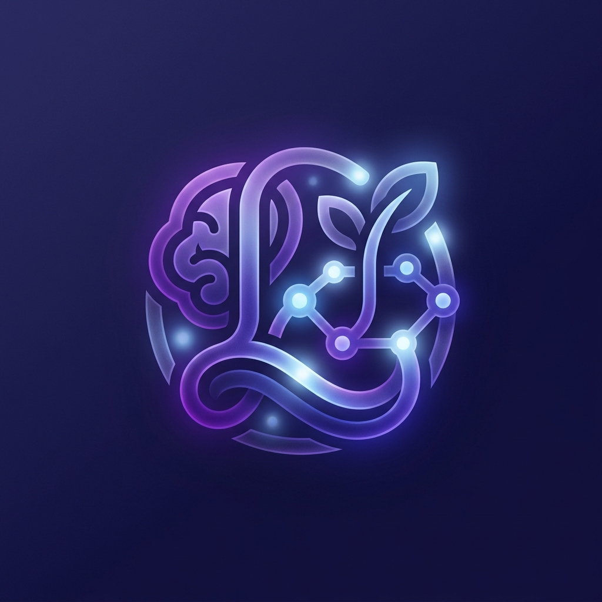
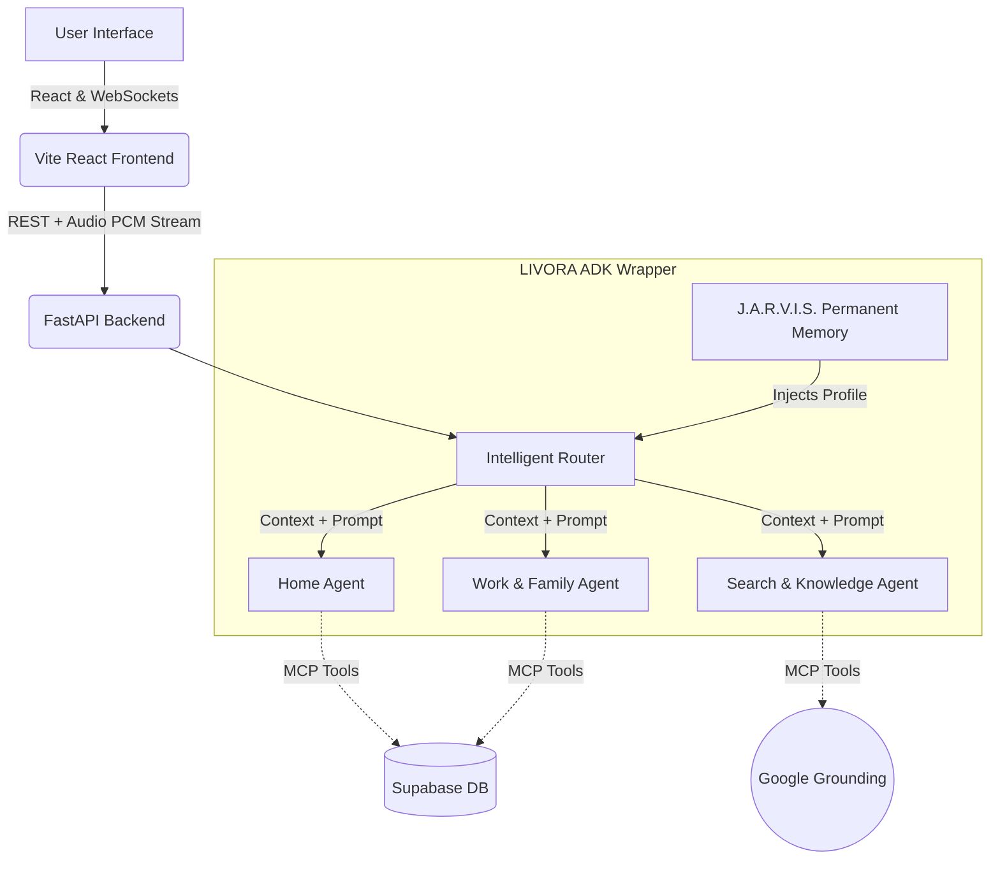
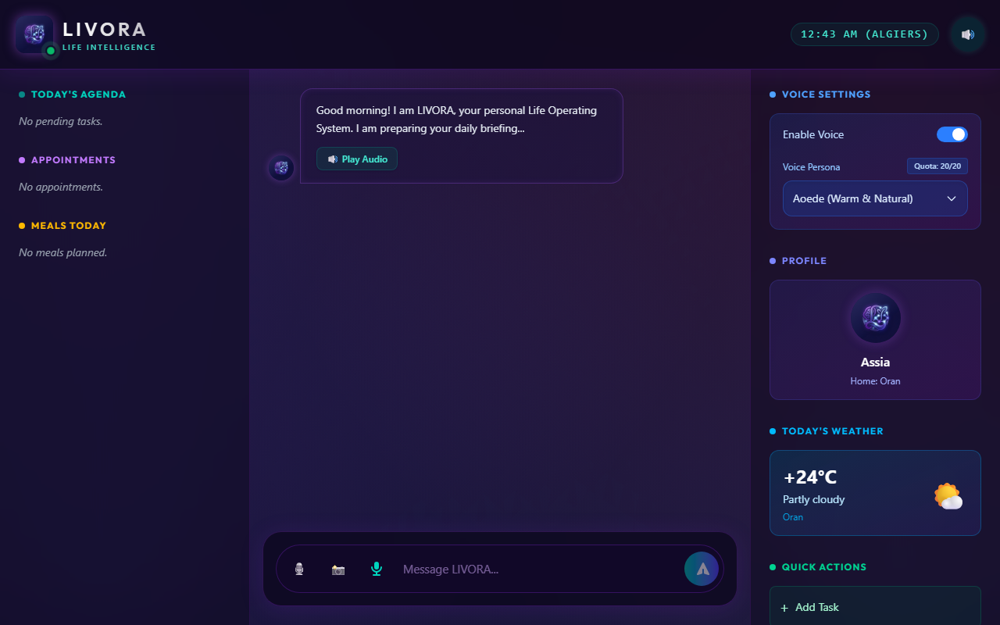
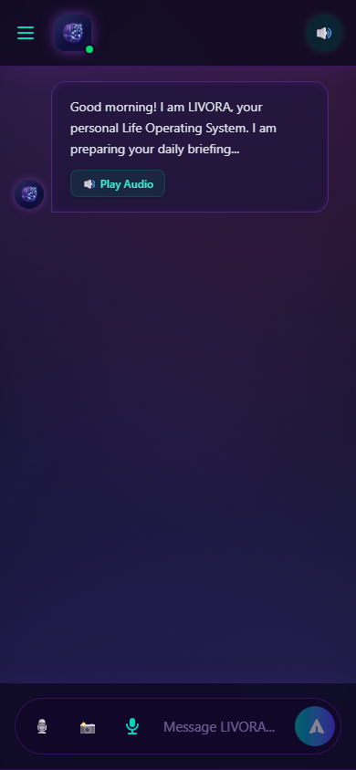
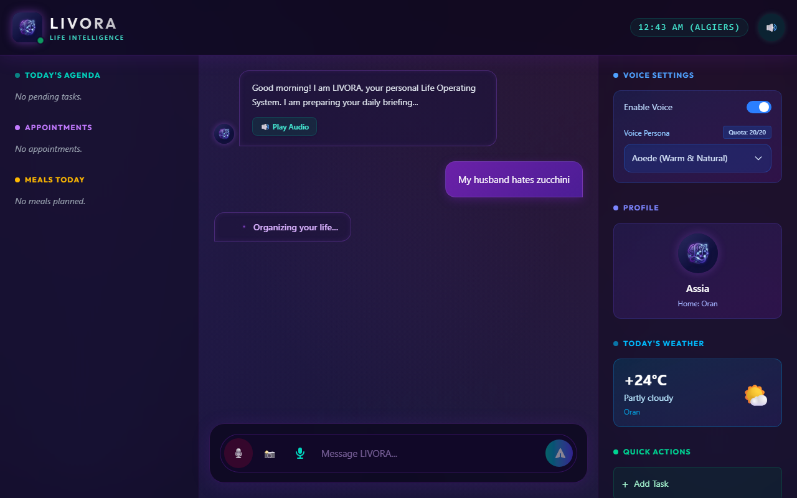
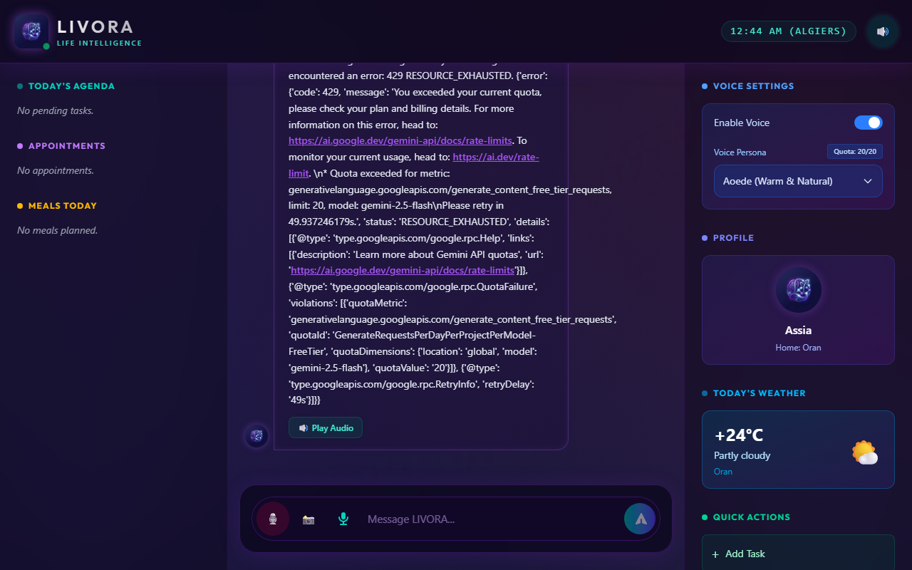

<div align="center">
  
  <h1>LIVORA: I Built JARVIS for Working Mothers</h1>
  <p><em>A mobile-first AI Life Intelligence System 
powered by Google ADK multi-agent architecture 
— because every woman deserves an intelligent 
assistant that knows her, remembers her, 
and never lets her down.</em></p>
  
  [](https://opensource.org/licenses/MIT)
  [](https://deepmind.google/technologies/gemini/)
  [](https://fastapi.tiangolo.com/)
  [](https://reactjs.org/)
</div>

---

## 💜 Why I Built LIVORA

I am a fullstack developer working from home.
I am also a wife and a mother.

Every single day I face the same 
exhausting questions:
- What should I cook tonight?
- Did I forget any appointments?
- When do I clean? When do I work?
- I am running late again...

I searched for an AI assistant that 
truly understood my life. 
Not a generic chatbot. 
Not another recipe app.

Something that KNOWS me. 
That REMEMBERS me. 
That manages my entire life intelligently.

I did not find it. So I built it.

This is LIVORA. 
She is the assistant I always needed.

> *'Tony Stark had JARVIS.  
> Working mothers have LIVORA.'*

---

## ✦ The Pitch: Problem, Solution, Value

### **The Problem: The Fragmented Digital Life**
We live in an era where our digital lives are scattered across a dozen disconnected apps: calendar apps for scheduling, weather apps for conditions, note-taking apps for groceries, task managers for work, and search engines for information. No system understands the *context* of who you are or connects these dots for you automatically.

### **The Solution: LIVORA**
LIVORA is a singular, Jarvis-like artificial intelligence designed to be the ultimate **Life Orchestrator**. Rather than forcing you to interact with ten different apps, LIVORA acts as your unified interface. You simply talk or type to her, and she delegates your request to a suite of highly specialized **Sub-Agents**.

### **Why Agents?**
A standard LLM is just a conversationalist; it cannot *do* things. By utilizing a **Multi-Agent System**, LIVORA transforms from a chatbot into a digital assistant that takes *action*. Her specialized sub-agents have direct access to database tools, external APIs, and memory storage. This means she doesn't just suggest a recipe—she immediately adds the missing ingredients to your real database shopping list. 

---

## ◈ Technical Architecture

LIVORA utilizes a modern, serverless-ready stack with bidirectional streaming architecture.



---

## ◈ Capstone Requirements & Evaluation

This project was built for the 5-Day AI Agents Hackathon and strictly implements the following key concepts:

### 1. Agent / Multi-Agent System (ADK)
LIVORA is built on a custom **Agent Development Kit (ADK)** wrapper (`LIVORAAgentDevelopmentKit` in `livora_orchestrator.py`). The ADK handles agent registration, intelligent intent routing, and automatic context injection. When you ask a question, the Router classifies it and delegates it to the correct specialized sub-agent (Home, Work, Family, or General).

### 2. MCP Server
LIVORA utilizes the **Model Context Protocol (MCP)** to expose external capabilities to the LLM securely. The backend features a standalone `mcp_server.py` built with `FastMCP` that provides 13 distinct tools (weather, memory saving, task management, meal planning, etc.) completely isolated from the agent reasoning loop.

### 3. Agent Skills (Agents CLI)
The project utilizes structured agent skills located in `.agents/skills/`. Each sub-agent (Meal Planner, Morning Briefing, Shopping List, Task Manager) has a dedicated `SKILL.md` defining its strict behavioral logic, constraints, and instructions, fully utilizing YAML frontmatter for programmatic parsing.

### 4. Deployability
LIVORA is designed for a split-stack serverless deployment:
- **Frontend:** Pre-configured for deployment on **Vercel** (`vercel.json` included).
- **Backend:** Pre-configured for deployment on **Railway** or **Render** (`render.yaml` included), complete with dynamic `VITE_API_URL` environment variables to auto-switch between localhost and production.

### 5. Security Features
LIVORA implements critical security features:
- **Strict Environment Variables**: No API keys or Supabase credentials are hardcoded. Everything is loaded securely via `.env`.
- **MCP Tool Isolation**: The LLM cannot execute arbitrary code; it can only request execution of the strictly defined tools exposed via the MCP server.
- **Quota Tracking**: The backend features a strict database-level quota tracker that limits premium Layer 1 TTS requests to 20 per day, protecting the system from API abuse and unexpected free-tier billing.

### 6. Antigravity (Advanced Features)
- **Bidirectional Live Audio**: Implemented `gemini-2.5-flash-native-audio-dialog` via a custom WebSocket proxy in FastAPI. You can hold a mic button, stream raw 16kHz PCM audio to the backend, and hear LIVORA's response streamed back *in real-time*.
- **Vision Integration**: Users can upload images (e.g., a photo of their fridge) directly to the chat, and the agent will use Gemini Multimodal capabilities to identify ingredients and suggest recipes.

---

## ⯈ Setup Instructions

### 1. Prerequisites
- Python 3.10+
- Node.js 18+
- A Google Gemini API Key
- A Supabase Project (URL and Anon Key)

### 2. Backend Setup
```bash
cd backend
python -m venv .venv
source .venv/Scripts/activate  # (or .venv/bin/activate on Mac/Linux)
pip install -r requirements.txt
pip install mcp fastmcp
```
Create a `.env` file in the `backend/` directory:
```env
GEMINI_API_KEY=your_google_key
SUPABASE_URL=your_supabase_url
SUPABASE_KEY=your_supabase_anon_key
```
Start the backend server:
```bash
python main.py
```

### 3. Frontend Setup
```bash
cd frontend
npm install
```
Start the frontend dev server:
```bash
npm run dev
```

---

## ◈ LIVORA In Action

### Desktop Command Center


### Mobile Experience  


### Memory In Action


### Live Voice Mode


### Morning Briefing


---

## ⯈ Future Vision

While LIVORA currently acts as a powerful personal life orchestrator, the future vision is to expand her capabilities to **Smart Home Hardware Integration**. By building out additional MCP servers, LIVORA will be able to interface with Home Assistant, controlling Philips Hue lights, Nest thermostats, and smart locks based purely on conversational context. Additionally, expanding the J.A.R.V.I.S. memory system to proactively text or email the user (using the Gmail/Twilio APIs) will transform LIVORA from a reactive assistant into a truly proactive companion.
